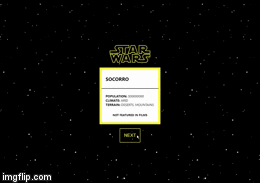

# B2W APP TEST



This project was bootstrapped with [Create React App](https://github.com/facebook/create-react-app)
JAVASCRIPT + CSS + SASS + REACT + WEBPACK + BABEL + ESLINT + COFFEE = ❤️


### Getting Started
_______________________

```

$ Git --version
>= v2.25

$ node --version
>= v12.14.1

```

### How to run

```
$ git clone https://github.com/rafaelfigueiredo-l/bw2-test
$ cd bw2-test
$ npm install
$ npm start
```

###  How to build
```
$ npm run build
```

### How to test
```
$npm test
```

### Built With

* [API SWAPI](https://swapi.co/)
* [React](https://reactjs.org/)
* [SASS](https://sass-lang.com/)
* [ESLint](https://eslint.org/)
* [Jest](https://jestjs.io/)
* [Babel](https://babeljs.io/)
* [Webpack](https://webpack.js.org/)
* [Node](https://nodejs.org/)
* [NPM](https://www.npmjs.com/)


## Author

* **Rafael Figueiredo** - [GitHub](https://github.com/rafaelfigueiredo-l/)